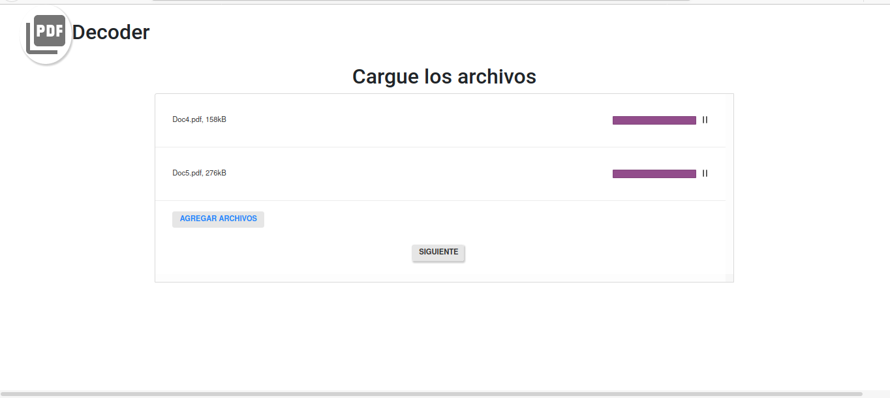
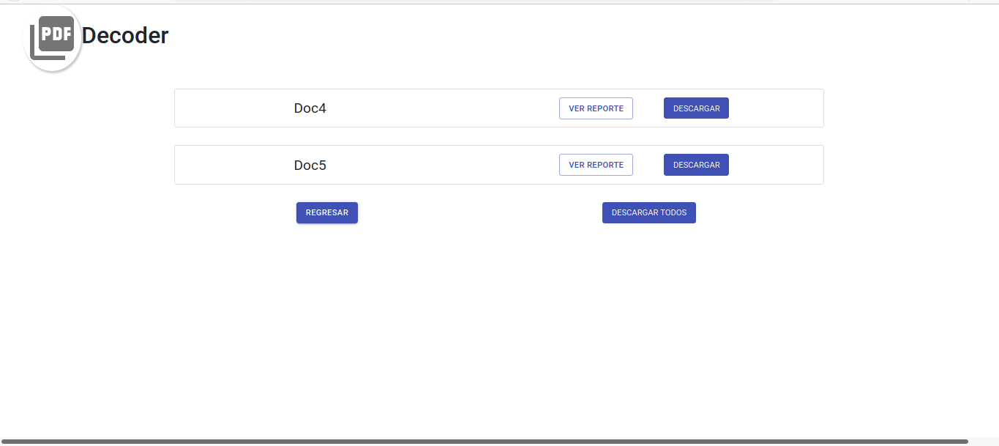
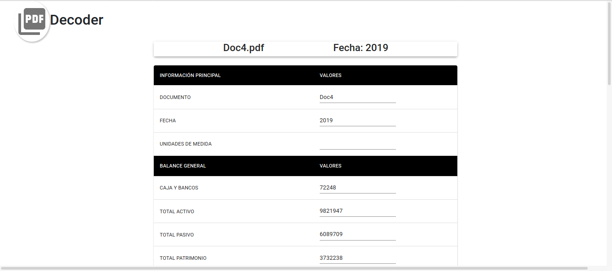
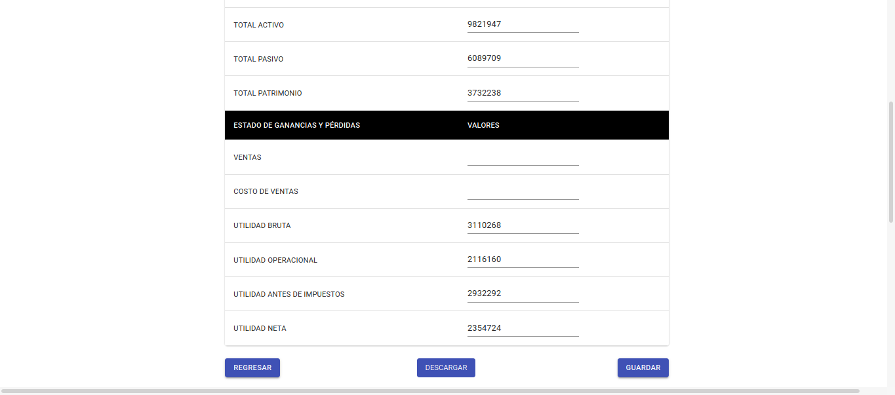
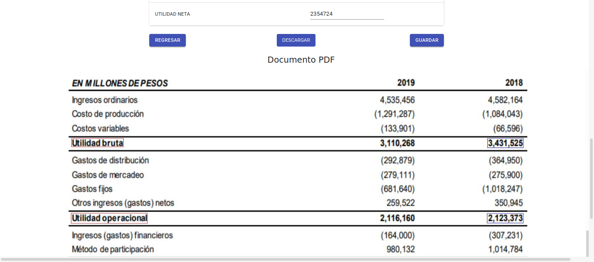
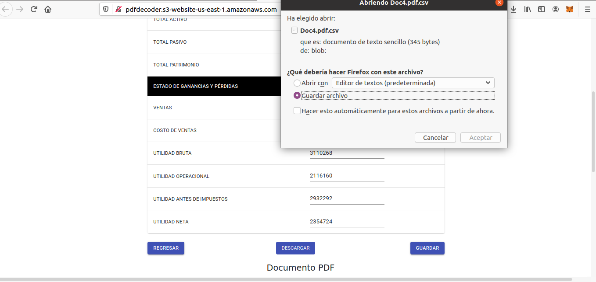

# fe-PDFDecoder

## Aplicacion
Link de la aplicacion desplegada http://pdfdecoder.s3-website-us-east-1.amazonaws.com/

Aplicacion desarrollada en la Hackathon BBVA 2020
Puedes ver el repositorio del beckend aqui https://github.com/Leinadh/be-PDFDecoder

Esta aplicacion consiste en detectar variables financieras como son activos, pasivos, patrimonios, etc de PYMES que desean solicitar algun servicio del banco. Actualmente la deteccion de estas se realizar de manera manual. Por ello, es necesario automatizar el proceso mencionado. Para ello, se uso el servicio de AWS Textract como OCR(Optical Character Recognition). Luego, a partir de algoritmos de machine learning y analisis de texto, se detectaron las variables correspondientes.  

   Paso 1 
   1. Cargar documentos en formato pdf de Balance General y/o Estado de Perdidas y Ganancias a la aplicacion web. 
   

   Paso 2 
   2. La aplicacion muestra como resultado las variables encontradas asi como los valores. Ademas, se pueden editar los valores de las variables que no se pudieron     enncontrar asi como observar las variables y valores resaltadas en el documento. 
   
   
   
   
   
   Paso 3 
   3. Luego de validar la informacion, se pueden descargar los resultados. 
   

   
